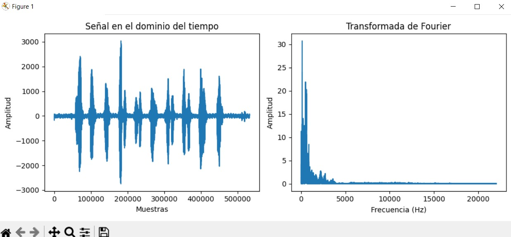
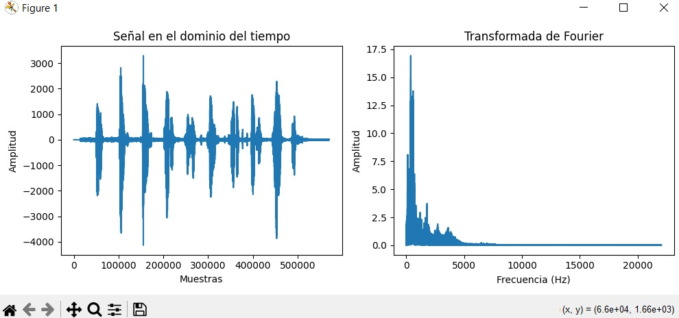

## ¿Por qué las voces de los integrantes son diferentes?

Las voces de las personas varían debido a factores fisiológicos y acústicos. Cada voz humana es única principalmente por las diferencias en la anatomía de los órganos que participan en la producción del sonido, como las cuerdas vocales, la cavidad nasal y bucal, y el tamaño de la laringe. Estas diferencias físicas afectan las frecuencias fundamentales y los armónicos que se generan al hablar, lo que crea timbres distintos para cada persona.

Desde una perspectiva de las comunicaciones, como menciona Tanenbaum, las señales de audio, incluidas las voces humanas, se transmiten a través de dos tipos principales de medios: guiados y no guiados. Los medios guiados, como cables de cobre, fibra óptica y cables coaxiales, permiten que la señal de voz viaje a través de un material físico. Aunque estos medios tienden a ser más controlados en términos de calidad, las señales aún experimentan ciertos efectos, como la atenuación y la distorsión. La atenuación es la pérdida de potencia de la señal a medida que se desplaza, lo que puede afectar la claridad de la voz al reducir la intensidad de ciertas frecuencias. Sin embargo, estas alteraciones no eliminan las características únicas de cada voz. La distorsión, por su parte, ocurre cuando diferentes partes de la señal viajan a distintas velocidades, alterando la forma original de la onda sonora. Aunque puede cambiar algunos aspectos del tono, la singularidad del timbre y los armónicos de cada persona sigue presente.

Por otro lado, en los medios no guiados, como las ondas electromagnéticas que se propagan por el aire, las señales de voz se convierten en ondas de radio que viajan sin el uso de un soporte físico, permitiendo su transmisión a grandes distancias. Sin embargo, estos medios están más expuestos a interferencias externas, como el ruido atmosférico o las obstrucciones en el entorno. A pesar de esto, la estructura acústica única de cada voz suele ser lo suficientemente robusta para que, incluso con ruido, las personas puedan distinguir fácilmente las diferencias entre las voces. Fenómenos como la distorsión por múltiples caminos, en la que las señales se reflejan en diferentes objetos y llegan al receptor en momentos distintos, también pueden causar eco o alterar temporalmente la señal. 

En ambos tipos de medios, aunque la calidad de la señal puede verse afectada por la atenuación, el ruido o la distorsión, las características fisiológicas de cada hablante se preservan en la señal acústica. Esto significa que las diferencias en las cuerdas vocales, el tamaño de la laringe y las cavidades de resonancia hacen que, incluso después de pasar por diversos medios de transmisión, cada voz conserve su carácter único. Por lo tanto, aunque el medio puede modificar ligeramente la señal, la individualidad de la voz humana se mantiene reconocible gracias a las propiedades acústicas que se originan en la fuente misma de la señal.

En los gráficos a continuación, se muestran las diferencias en las frecuencias fundamentales y los armónicos de las voces de los integrantes del grupo. Se puede observar cómo las variaciones en los timbres y la potencia de los armónicos confirman la teoría de que cada voz humana es única.

### Integrante 1:

### Integrante 2:

Al finalizar la integración de los gráficos, se puede observar que los resultados visuales respaldan de manera clara la explicación teórica sobre las diferencias fisiológicas en las voces. Las gráficas en el dominio del tiempo y la frecuencia muestran patrones únicos para cada integrante.

## ¿Por qué la comparación de voces es tan poco exacta mediante armónicos?

La comparación de voces mediante armónicos es imprecisa porque los armónicos representan solo una parte de la firma acústica completa de una voz. Los armónicos son frecuencias múltiples de una frecuencia fundamental y contribuyen al timbre de la voz, pero no capturan la complejidad total de la señal vocal. La voz humana es una mezcla compleja de elementos que van mucho más allá de las frecuencias armónicas. Cada persona genera una combinación única de ruido, inflexiones, modulaciones y formantes, los cuales varían constantemente durante el habla. Los formantes son bandas de frecuencias amplificadas por las cavidades vocales y son cruciales para diferenciar los sonidos de las vocales, mientras que las inflexiones y modulaciones reflejan los matices emocionales y la intención del hablante.

Además, la voz cambia dinámicamente en el tiempo, ya que las personas no hablan en una frecuencia constante. Factores como el contexto emocional, la entonación y la velocidad del habla juegan un papel clave en cómo se produce el sonido en un momento dado. Una persona puede hablar con un tono más alto o bajo dependiendo de su estado emocional, y estas variaciones afectan la forma en que los armónicos se distribuyen en la señal. Incluso el entorno físico donde se encuentra el hablante, como el ruido de fondo o la reverberación, influye en la calidad de la voz grabada, haciendo que las comparaciones basadas solo en armónicos sean más difíciles y menos precisas.

Otro aspecto a considerar es que la voz humana es asimétrica y no perfectamente periódica. Esto significa que los armónicos no siempre aparecen de manera constante y ordenada; pueden cambiar sutilmente de un momento a otro.

Según lo discutido en las secciones sobre "Medios de Transmisión Guiados y No Guiados" del libro de Tanenbaum, las señales, incluidas las señales de voz, pueden sufrir diversas degradaciones y distorsiones a medida que viajan a través de un canal de comunicación. Estas distorsiones son particularmente relevantes cuando se trata de analizar la precisión de los armónicos en las señales de voz. En los medios de transmisión guiados, como cables de cobre o fibra óptica, las señales de voz pueden experimentar atenuación, que es la disminución gradual de la intensidad de la señal a medida que recorre largas distancias. Esta atenuación afecta tanto las frecuencias fundamentales como los armónicos, lo que provoca una pérdida de fidelidad en la transmisión de la señal original.

En los medios no guiados, como se comentó anteriormente, las ondas de radio o microondas utilizadas en la transmisión inalámbrica, las señales de voz pueden sufrir interferencias externas, como ruido atmosférico, ondas electromagnéticas de otros dispositivos, o incluso reflexiones y refracciones que pueden distorsionar la señal. Estas interferencias alteran la composición de los armónicos y otros componentes de la voz, haciendo que la señal recibida sea diferente de la original. Los armónicos, al ser parte integral de la estructura del timbre vocal, se ven afectados por estos fenómenos, lo que provoca fluctuaciones en la amplitud y la fase de las frecuencias armónicas.

Además, efectos de ruido y distorsión pueden provocar la introducción de componentes adicionales en la señal, que no forman parte de la voz original. Por ejemplo, el ruido de fondo en una llamada telefónica o las interferencias electromagnéticas en una red inalámbrica pueden cambiar la percepción de las frecuencias armónicas. El ruido de alta frecuencia, en particular, puede enmascarar armónicos más débiles o introducir señales espurias que complican aún más el análisis preciso de la voz. 

El canal de transmisión también puede introducir distorsión no lineal, donde las diferentes frecuencias en una señal se ven afectadas de manera desigual. Esto puede causar que los armónicos se desplacen o se alteren, lo que distorsiona la firma acústica de la voz. A diferencia de las frecuencias fundamentales, que son relativamente estables, los armónicos pueden ser mucho más sensibles a este tipo de distorsiones. Como resultado, un análisis de voz basado únicamente en los armónicos no refleja con precisión la voz original, ya que las distorsiones del canal modifican estos componentes críticos de manera impredecible.

Otro fenómeno a considerar es el desvanecimiento de múltiples trayectorias, que es común en medios no guiados como las ondas de radio. En este caso, las señales reflejadas por diferentes objetos llegan al receptor en diferentes momentos, lo que provoca la superposición de versiones ligeramente distintas de la señal original. Este desvanecimiento puede generar fluctuaciones en la amplitud de los armónicos, afectando la consistencia de la señal. Cuando se intenta realizar una comparación basada en armónicos en un entorno afectado por desvanecimientos, la precisión se reduce aún más.

Para ilustrar la dificultad de realizar una comparación precisa entre voces usando solo armónicos, se realizó un experimento en el que un integrante grabó su voz contando del 1 al 10. Luego, otro integrante grabó únicamente el número "10". El objetivo fue buscar una coincidencia entre la parte final del audio del primer integrante y la grabación del segundo.

#### Comparación:

El gráfico resultante (ver Figura 1) muestra las señales de ambas grabaciones y cómo el código intenta identificar la coincidencia. Aunque los resultados de la correlación arrojan una confianza de la correlación de magnitud del 100.0% y una confianza de la correlación de potencia del 95.26%, esto no implica una coincidencia perfecta en términos perceptuales o acústicos. A nivel matemático, estos valores sugieren una alta similitud en la estructura general de las señales, pero en la práctica, las variaciones en el timbre, las modulaciones y otros factores acústicos no capturados en los armónicos hacen que la coincidencia no sea exacta.